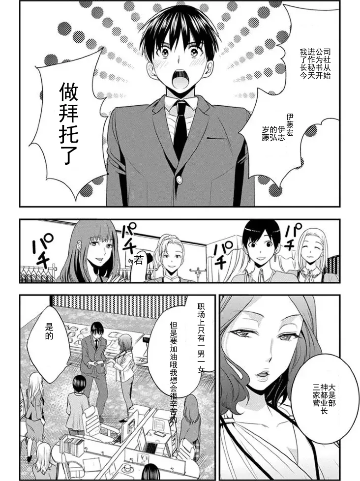

# WebP 图片浏览器与逐张翻译工具

一个基于网易智云API的漫画翻译工具，支持多语言翻译，自动覆盖原图文字区域。项目使用GPT生成

---

## 功能特性

1. **按文件名数字顺序显示**  
   - 支持选择本地文件夹，按文件名中的数字排序显示 WebP 图片。
2. **逐张翻译**  
   - 点击“逐张翻译”按钮，按显示顺序依次调用后端接口翻译所有图片。
3. **单张翻译**  
   - 双击任意图片，可单独翻译该图片。
4. **另存为全部图片**  
   - 将当前显示的所有图片另存为 WebP 格式，保留原文件名。
   - 支持浏览器文件夹选择（`showDirectoryPicker` API）。

---

## 项目结构
```
project/
├─ templates/
│ └─ index.html
├─ app.py
└─ README.md
```
---

## 使用说明

- 应用注册
  1. 进入有道智云API官网
  2. 创建应用完善信息
  3. 获取应用ID和密钥
  4. 修改app.py中的`APP_KEY`和`APP_SECRET`

- 运行项目 
  1. cmd控制台运行 `python app.py `
  2. 点击 **选择文件夹** 按钮，选择包含 WebP 图片的文件夹
  3. 可点击 **逐张翻译** 按钮翻译全部图片  
  4. 或 **双击** 单张图片进行单独翻译  
  5. 点击 **另存为** 按钮，将图片保存到本地文件夹  

## 效果展示

